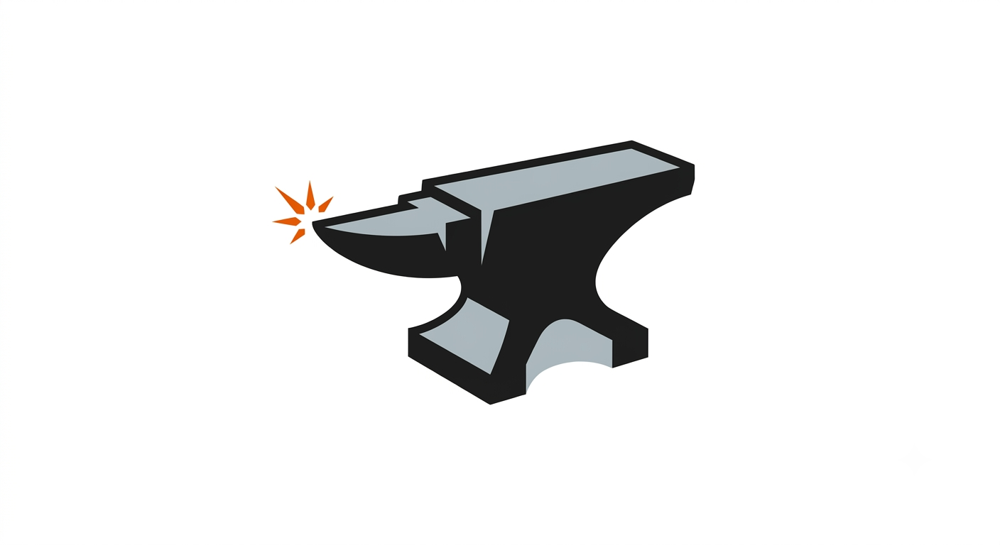

# anvil

<p align="center">
  
</p>

<p align="center">
  <strong>Config-driven deep learning experiments on PyTorch + Lightning.</strong>
</p>

One YAML or typed blueprint → validated pydantic config → `build()` → train / eval / export.
CLI and notebooks share the same entrypoints (`anvil.forge`, `anvil.resume`, …).

Agent rules: [`.agents/AGENTS.md`](.agents/AGENTS.md)

## Install

```bash
uv sync                          # core only
uv sync --extra stock            # stock layer marker
uv sync --extra blueprints       # blueprints marker (needs stock)
uv sync --extra export           # ONNX export (onnx, onnxscript)
uv sync --extra all              # beartype + ONNX
uv sync --extra all --group dev  # + pytest / ruff / ty
```

| Extra | What you get |
|-------|----------------|
| *(none)* | `anvil.core` — framework |
| `stock` | Batteries-included material (`anvil.stock`) |
| `blueprints` | Ready-to-forge recipes (`anvil.blueprints`) |
| `export` | ONNX export deps |
| `all` | `beartype` + ONNX |

Editable installs include the full package tree. `stock` / `blueprints` are **install markers**
(plus soft-import guards); prefer the matching extra when you intend to use that layer.

## Layout

```text
anvil.core         # the anvil (frozen framework)
anvil.stock        # material: components, data, tasks, metrics, callbacks
anvil.blueprints   # recipes (e.g. ResNet18Classification)
configs/           # shipped YAML entrypoints
```

## CLI

```bash
anvil init [DIR] [--blueprint DOTTED.PATH]
anvil forge CONFIG [--dry-run] [--no-smoke] [key=value...]
anvil resume TARGET [key=value...]          # run dir, project, or project/name
anvil validate CONFIG --ckpt CKPT [key=value...]
anvil test CONFIG --ckpt CKPT [key=value...]
anvil export CONFIG --ckpt CKPT --out MODEL.onnx [--input-shape 1,3,32,32] [--opset 17]
anvil find-batch-size CONFIG [...]
anvil find-lr CONFIG [...]
```

Exit codes: `0` ok · `1` config · `2` shape/smoke · `3` training/export error.

## Quick start

```bash
anvil init my_exp --blueprint anvil.blueprints.ResNet18Classification
anvil forge my_exp/config.yaml --dry-run
anvil forge my_exp/config.yaml task.data.batch_size=256 task.optimizer.lr=0.05

# after training
anvil resume my_exp                      # or project/name under output_dir
anvil validate my_exp/config.yaml --ckpt outputs/.../checkpoints/last.ckpt
anvil test my_exp/config.yaml --ckpt outputs/.../checkpoints/last.ckpt
anvil export my_exp/config.yaml --ckpt outputs/.../checkpoints/last.ckpt --out model.onnx
```

Shipped examples:

```bash
anvil forge configs/resnet18_synthetic.yaml --dry-run
anvil forge configs/resnet18_cifar10.yaml
```

## Python / Colab

Same path as the CLI — use `raise_on_error=True` in notebooks:

```python
import anvil
from anvil.blueprints import ResNet18Classification
from anvil.stock import ClassificationSyntheticData

anvil.forge(
    ResNet18Classification(
        data=ClassificationSyntheticData(train_size=64, val_size=32, batch_size=8)
    ),
    raise_on_error=True,
)

# anvil.resume("project/name", raise_on_error=True)
# anvil.validate(cfg, ckpt, raise_on_error=True)
# anvil.test(cfg, ckpt, raise_on_error=True)
# anvil.export(cfg, ckpt, "model.onnx", raise_on_error=True)
```

## Config notes

- YAML `_target_` is always a **fully-qualified** dotted path to a pydantic config class.
- Slots hold configs that `.build()` to modules — not live `nn.Module`s (escape hatch exists;
  marks the run non-reproducible and blocks resume).
- Trainer callbacks / plugins accept Lightning’s `T | list[T] | None` shape, but typed as
  `CallbackConfig` / `PluginConfig`.

```yaml
trainer:
  model_summary_max_depth: 3
  gradient_clip_val: 1.0
  callbacks:
    - _target_: anvil.stock.callbacks.EarlyStopping
      monitor: val/loss
      patience: 10
    - _target_: anvil.stock.callbacks.LearningRateMonitor
    - _target_: anvil.stock.callbacks.WeightAveraging
```

## Export (ONNX)

Requires `anvil[export]` (or `anvil[all]`). Exports `Task.example_forward` (inference graph
only — no loss/metrics) from a checkpoint.

```bash
anvil export CONFIG.yaml --ckpt last.ckpt --out model.onnx --input-shape 1,3,32,32
```

Default input shape is `task.data.example_input_shape` with batch size forced to `1`.

## Shape checks

Batch jaxtyping checks (via `beartype`) run under `--dry-run`, in pytest, or when
`global.strict_shapes: true` / `ANVIL_STRICT_SHAPES=1`. Install `anvil[all]`.

## Docs

- [Agent rules](.agents/AGENTS.md)
